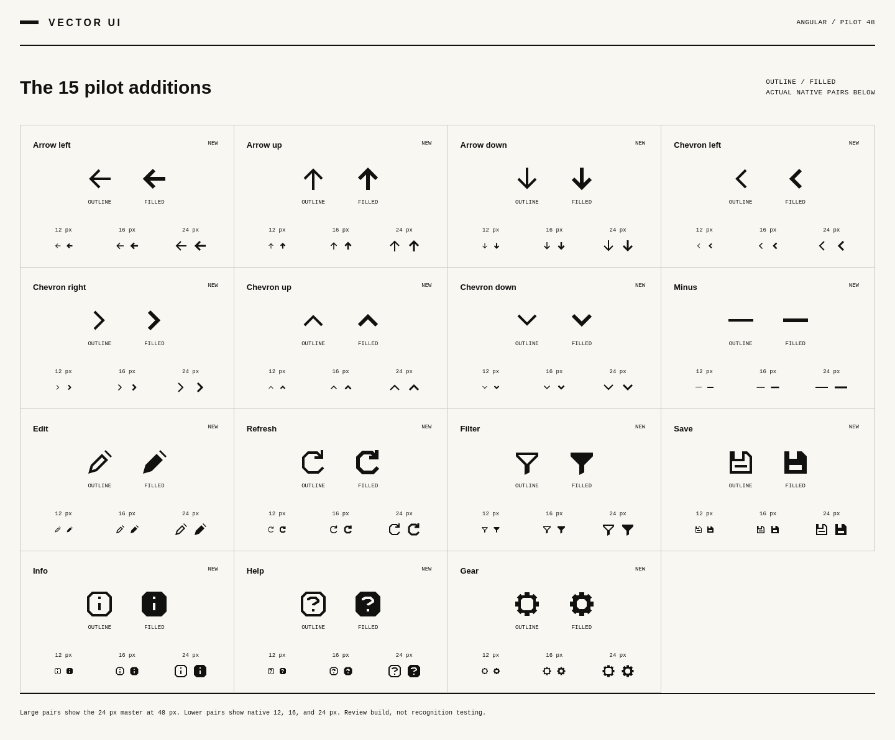

# Vector UI — Angular pilot 48

**Working name · 0.5.0-pilot.2 · private review build, not a public release**

48 canonical icons, two appearances, and three optical masters: **288 individual SVG drawings**. The original 33 concepts / 198 exported SVGs match the supplied v0.4.1 baseline byte for byte. The 15 additions use the same authored construction system.

Open [`docs/catalog/index.html`](docs/catalog/index.html) for the complete catalog. The HTML embeds its data and artwork; it does not load fonts, libraries, or SVGs from a network. All cards, native pairs, examples, and notes are present without JavaScript. Search, inspector, downloads, and toggles require JavaScript.



## What is finished in this pilot

- 48 icons in `outline` / `filled`, at native 12 / 16 / 24 px.
- A canonical catalog, keywords, explicit availability, provenance, pair policy, and review notes.
- A deterministic SVG/registry/sprite/catalog build; 198 immutable baseline hashes.
- A self-contained guide with all 48 icons, 96 labeled examples, six display sizes, four surfaces, SVG inspection, and native downloads.
- An ES-module helper and 48 isolated per-icon imports. No React or Vue adapter is claimed.
- Schema, SVG safety, geometry, critical-gap, raster, export, module, and rebuild checks.
- A GitHub Actions workflow, contribution templates, release gate, and remaining-work ledger.

## What is not finished

The remaining **72 Core proposals**, Rounded, independent design sign-off, user-recognition testing, final name, and public publication. The distribution license is selected: BSD 3-Clause, copyright Leo Farias. The package is committed on `feat/angular-icon-family-pilot` and open as draft pull request [#244](https://github.com/btwld/remix/pull/244). No npm package was published. This is still a private pilot, not a public release.

**Browser evidence from the handoff host:** Firefox 144 passed the full catalog script (HTTP, file, and module loading). Its forced-colors audit originally measured the selected star at 2.941:1 on the light surface because Firefox's Highlight (`#3399FF`) with HighlightText (white) misses 3:1. The selected star and primary action keep that Highlight fill. The color rule declares `CanvasText` first and `contrast-color(Highlight)` second, because Firefox drops a lone `contrast-color()` declaration and would otherwise paint white. After that change the light selected star measures 7.141:1 and the primary label measures 7.141:1. `aria-pressed`, the name "Favorite project", the 44px target, and the 3px focus outline stay in place. Chromium 151 passed the same forced-colors audit, including HTTP and file loading; its full catalog script stopped when headless Copy SVG left `#copy-status` empty. WebKit did not launch on this Amazon Linux host. Do not describe this as cross-browser certification or branded Safari evidence.

## Use the SVGs

`generated/angular/outline/16/sliders.svg`

`generated/angular/filled/24/gear.svg`

Inline SVG inherits `currentColor`. An SVG used as an `` is a separate document: parent text color does not automatically recolor it. Each raw file has a standalone title. When placing it inside a labeled button, hide the inner SVG from assistive technology instead of announcing both the icon and the button.

```html
<button type="button" aria-label="Adjust view">
  <!-- Insert the Sliders SVG inline, with aria-hidden="true" and no duplicate role/title. -->
</button>
```

## Use an isolated JavaScript import

```js
import sliders from './packages/web/icons/sliders.mjs';

// The enclosing control supplies the accessible name.
button.setAttribute('aria-label', 'Adjust view');
button.innerHTML = sliders({ appearance: 'outline', size: 16 });
```

For a named standalone symbol:

```js
import { iconSvg } from './packages/web/index.mjs';
const markup = iconSvg('info', { size: 16, title: 'About this item' });
```

The convenience API loads all icon path data. Per-icon imports reference only that icon and the shared renderer. They are not an icon font. Unknown names and unavailable styles/appearances/masters throw errors rather than silently substituting artwork. `settings` is a search keyword; use canonical `gear` or `sliders` deliberately.

## Build and check

The pinned toolchain this package was authored against is CPython 3.13, Node 22.16, Shapely 2.1.2, CairoSVG 2.8.2, and Cairo 1.18.4. The handoff checkout ran the same pins on CPython 3.12.13, Node 24.14.1, CairoSVG 2.8.2, and Cairo 1.18.0. Those are separate runtimes. Reports from one must not be relabeled as the other. Dependencies are pinned; this is not a claim that every pin is the newest release.

```sh
python -m venv .venv
# Activate the environment using the command for your shell.
python -m pip install -r requirements-dev.txt
python source/build.py
python tools/run_checks.py
```

Full browser validation requires the browser executables and their operating-system dependencies:

```sh
python -m playwright install --with-deps chromium firefox webkit
python tests/integration/browser_checks.py --browser chromium
python tests/integration/browser_checks.py --browser firefox
python tests/integration/browser_checks.py --browser webkit
```

The default browser command starts a temporary local server and requires actual HTTP, local-file, and module-consumer loading. It fails when any required loading mode fails. `--mode content` is an explicitly limited fallback; its report is marked **partial integration**, not a full pass.

To host the guide manually:

```sh
python -m http.server 8000
# Visit http://localhost:8000/docs/catalog/index.html
```

To compare committed pixel snapshots:

```sh
python tests/visual/pixel_regression.py
```

Do not use `--create-baseline` to hide a failed diff. That option is a maintainer action only after reviewing actual native renderings. The first baseline was created during this local pilot pass; independent approval remains pending.

## Repository map

```text
catalog/                 identities, availability, keywords, schemas, exceptions
source/angular/          locked baseline and 15 authored additions
source/web/              guide presentation and behavior
source/build.py          one deterministic generation entry point
generated/angular/       288 standalone SVG assets
generated/sprites/       six size/appearance sprites and one combined sprite
packages/web/            ES-module API and isolated imports
docs/catalog/            self-contained catalog and proof pages
docs/                    design, accessibility, review, and release instructions
tests/                   fixtures, 17 test methods, pixel and browser checks
reports/                 actual local results with explicit scope
review/                  screenshots and native-size evidence
planning/                unimplemented Core 120 proposal and user-research templates
.github/                 CI and contribution templates
```

See [execution status](EXECUTION-STATUS.md), [validation report](docs/VALIDATION-REPORT.md), and [construction rules](docs/construction.md). The package is intentionally private until the open release decisions are resolved.


## Audit patch (pilot.2)

The 48 glyphs / 288 SVGs are unchanged. This patch addresses forced-colors
controls, a coordinate-aligned inspector, native raster proofs, Warning usage
rules, report freshness, and SVG parsing. `catalog/restrictions.json` is the
single size/appearance-aware usage source; its hashes bind it to the reviewed
artwork. `getIconUsage` exposes the same rule to JavaScript consumers.

```sh
python source/build.py
python tools/run_checks.py
python tests/integration/browser_checks.py --mode full --browser chromium
python tests/integration/audit_browser_checks.py --mode full --browser chromium
python tools/release_gate.py
```

Repeat both browser runners for Firefox and WebKit. A missing executable or
failed navigation is a failure, not permission to replace full mode with a
passing content-mode report. `--executable /path/to/chromium` is available for
local system Chromium. Content mode is a separately labeled diagnostic only.

Technical reports bind all current source, tests, catalog, dependency pins,
generated outputs, workflow files, and relevant local tool versions. Reports
from different toolchains must be rerun, not relabeled. Build changes invalidate
old reports. The rebuild check uses a clean temporary tree; pixel tests never
refresh baselines in validation mode. Report fingerprints are not signatures.

See `reports/AUDIT-FIXES.md` for actual patch results and test boundaries.
Unassigned exception owners, design review, and human recognition remain
deliberate public-release blockers. The BSD 3-Clause license is selected;
public release is not.
